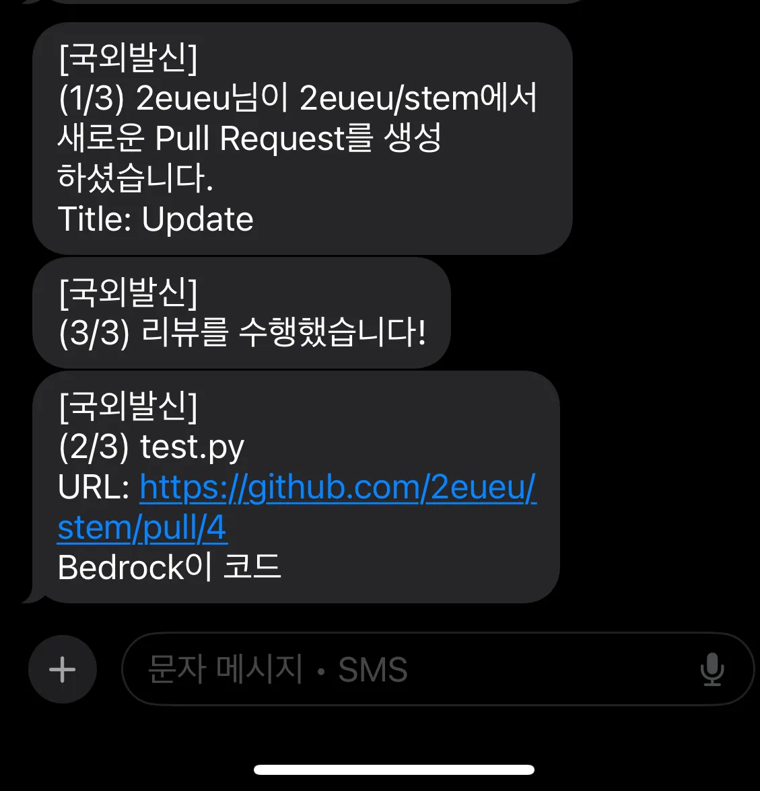

# 📢 GitHub Serverless Notifier

**A serverless notification system that delivers real-time alerts to your team whenever a GitHub repository receives new stars or activity.**  
Built entirely using AWS services like Lambda, EventBridge, API Gateway, and DynamoDB — all without any traditional server.

---

## 🧩 Project Overview

This project demonstrates how to build a fully serverless system to track GitHub events (e.g., stars) and send real-time alerts using AWS services.  
It is optimized for team collaboration and is deployable without managing any infrastructure.

---

## 🛠️ Technologies Used

| Service       | Role                                                                 |
|---------------|----------------------------------------------------------------------|
| **Lambda**     | Serverless compute to handle GitHub webhook events                  |
| **API Gateway**| Receives GitHub webhook POST requests                               |
| **DynamoDB**   | Stores event metadata and history                                   |
| **SNS**        | Publishes notifications (email/SMS)                                 |
| **EventBridge**| Triggers based on DynamoDB writes to invoke SNS                     |
| **Bedrock**    | (Optional) Adds generative AI layer for summarizing notifications   |

---

## 📈 Workflow Architecture

<p align="center">
  
</p>

1. GitHub triggers a webhook when the repository receives a new star  
2. The webhook hits **API Gateway**, which routes the request to an AWS **Lambda**  
3. The Lambda parses the payload and saves event details into **DynamoDB**  
4. An **EventBridge Rule** listens for new items in the DynamoDB table  
5. The rule triggers another Lambda or directly invokes **SNS**  
6. SNS sends real-time notifications (via Email or SMS) to subscribed users  
7. (Optional) **Bedrock** formats the message using a foundation model

---

## 🚀 How to Deploy

```bash
# Clone the repository
git clone https://github.com/2eueu/stem.git
cd stem

# Set up AWS IAM Role with required permissions
# Deploy using AWS SAM, Serverless Framework, or manually via AWS Console
